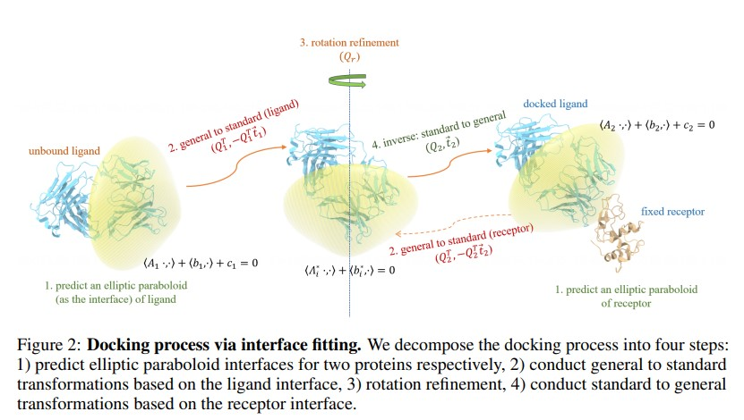

# **Awesome ICLR 2024 Graph Paper Collection**

This repo contains a comprehensive compilation of graph papers that were presented at the esteemed International Conference on Learning Representations (ICLR) in the year 2024. Graph or Geometric machine learning possesses an indispensable role within the domain of machine learning research, providing invaluable insights, methodologies, and solutions to a diverse array of challenges and problems. Whether it entails pioneering architectures, optimization techniques, theoretical analyses, or empirical investigations, these papers make substantial contributions towards the advancement of the field. All the papers categorised in different subtopics.

# **All Papers:** 

  
View paper list!

- [**Heterophily**](https://github.com/azminewasi/Awesome-Graph-Research-ICLR2024#heterophily)
  - [Locality-Aware Graph Rewiring in GNNs](https://github.com/azminewasi/Awesome-Graph-Research-ICLR2024#locality-aware-graph-rewiring-in-gnns)
  - [Probabilistically Rewired Message-Passing Neural Networks](https://github.com/azminewasi/Awesome-Graph-Research-ICLR2024#probabilistically-rewired-message-passing-neural-networks)
- [**Graph Transformer**](https://github.com/azminewasi/Awesome-Graph-Research-ICLR2024#graph-transformer)
  - [Training Graph Transformers via Curriculum-Enhanced Attention Distillation](https://github.com/azminewasi/Awesome-Graph-Research-ICLR2024#training-graph-transformers-via-curriculum-enhanced-attention-distillation)
  - [Transformers vs. Message Passing GNNs: Distinguished in Uniform](https://github.com/azminewasi/Awesome-Graph-Research-ICLR2024#transformers-vs-message-passing-gnns-distinguished-in-uniform)
  - [Polynormer: Polynomial-Expressive Graph Transformer in Linear Time](https://github.com/azminewasi/Awesome-Graph-Research-ICLR2024#polynormer-polynomial-expressive-graph-transformer-in-linear-time)
- [**Spectral/Polynomial GNN**](https://github.com/azminewasi/Awesome-Graph-Research-ICLR2024#spectralpolynomial-gnn)
  - [Learning Adaptive Multiresolution Transforms via Meta-Framelet-based Graph Convolutional Network](https://github.com/azminewasi/Awesome-Graph-Research-ICLR2024#learning-adaptive-multiresolution-transforms-via-meta-framelet-based-graph-convolutional-network)
  - [PolyGCL: GRAPH CONTRASTIVE LEARNING via Learnable Spectral Polynomial Filters](https://github.com/azminewasi/Awesome-Graph-Research-ICLR2024#polygcl-graph-contrastive-learning-via-learnable-spectral-polynomial-filters)
- [**Shape-aware Graph Spectral Learning**](https://github.com/azminewasi/Awesome-Graph-Research-ICLR2024#shape-aware-graph-spectral-learning)
  - [HoloNets: Spectral Convolutions do extend to Directed Graphs](https://github.com/azminewasi/Awesome-Graph-Research-ICLR2024#holonets-spectral-convolutions-do-extend-to-directed-graphs)
- [**Text-attributed Graph**](https://github.com/azminewasi/Awesome-Graph-Research-ICLR2024#text-attributed-graph)
  - [Harnessing Explanations: LLM-to-LM Interpreter for Enhanced Text-Attributed Graph Representation Learning](https://github.com/azminewasi/Awesome-Graph-Research-ICLR2024#harnessing-explanations-llm-to-lm-interpreter-for-enhanced-text-attributed-graph-representation-learning)
- [**Equivariant GNNs**](https://github.com/azminewasi/Awesome-Graph-Research-ICLR2024#equivariant-gnns)
  - [Orbit-Equivariant Graph Neural Networks](https://github.com/azminewasi/Awesome-Graph-Research-ICLR2024#orbit-equivariant-graph-neural-networks)
  - [Rethinking the Benefits of Steerable Features in 3D Equivariant Graph Neural Networks](https://github.com/azminewasi/Awesome-Graph-Research-ICLR2024#rethinking-the-benefits-of-steerable-features-in-3d-equivariant-graph-neural-networks)
  - [Clifford Group Equivariant Simplicial Message Passing Networks](https://github.com/azminewasi/Awesome-Graph-Research-ICLR2024#clifford-group-equivariant-simplicial-message-passing-networks)
  - [Graph Neural Networks for Learning Equivariant Representations of Neural Networks](https://github.com/azminewasi/Awesome-Graph-Research-ICLR2024#graph-neural-networks-for-learning-equivariant-representations-of-neural-networks)
- [**Theory, Weisfeiler & Leman go**](https://github.com/azminewasi/Awesome-Graph-Research-ICLR2024#theory-weisfeiler--leman-go)
  - [G^2N^2: Weisfeiler and Lehman go grammatical](#g2n2--weisfeiler-and-lehman-go-grammatical)
  - [Beyond Weisfeiler-Lehman: A Quantitative Framework for GNN Expressiveness](#beyond-weisfeiler-lehman-a-quantitative-framework-for-gnn-expressiveness)
- [**GDiffusion-based generation**](#gdiffusion-based-generation)
  - [Graph Generation with $K^2$-trees](#graph-generation-with--k2-trees)
- [**Contrastive Learning**](#contrastive-learning)
  - [PolyGCL: GRAPH CONTRASTIVE LEARNING via Learnable Spectral Polynomial Filters](https://github.com/azminewasi/Awesome-Graph-Research-ICLR2024#polygcl-graph-contrastive-learning-via-learnable-spectral-polynomial-filters)
  - [A Graph is Worth 1-bit Spikes: When Graph Contrastive Learning Meets Spiking Neural Networks]()
- [**Proteins**](#a-graph-is-worth-1-bit-spikes-when-graph-contrastive-learning-meets-spiking-neural-networks)
  - [Rigid Protein-Protein Docking via Equivariant Elliptic-Paraboloid Interface Prediction](#rigid-protein-protein-docking-via-equivariant-elliptic-paraboloid-interface-prediction)
- [**Proteins,Crystals and Material Generation**](#proteinscrystals-and-material-generation)
  - [Space Group Constrained Crystal Generation](#space-group-constrained-crystal-generation)
  - [Scalable Diffusion for Materials Generation](#scalable-diffusion-for-materials-generation)
  - [MOFDiff: Coarse-grained Diffusion for Metal-Organic Framework Design](#mofdiff-coarse-grained-diffusion-for-metal-organic-framework-design)
- [**Causality**](#causality)
  - [Causality-Inspired Spatial-Temporal Explanations for Dynamic Graph Neural Networks](#causality-inspired-spatial-temporal-explanations-for-dynamic-graph-neural-networks)
- [**Anomaly Detection**](#anomaly-detection)
  - [Rayleigh Quotient Graph Neural Networks for Graph-level Anomaly Detection](#rayleigh-quotient-graph-neural-networks-for-graph-level-anomaly-detection)
  - [Boosting Graph Anomaly Detection with Adaptive Message Passing](#boosting-graph-anomaly-detection-with-adaptive-message-passing)
- [**LLM**](#llm)
  - [Talk like a Graph: Encoding Graphs for Large Language Models](#talk-like-a-graph-encoding-graphs-for-large-language-models)
  - [Label-free Node Classification on Graphs with Large Language Models (LLMs)](#label-free-node-classification-on-graphs-with-large-language-models-llms)

---
---

## Heterophily

### Locality-Aware Graph Rewiring in GNNs
> The main contribution of this work is a novel graph rewiring framework that simultaneously reduces over-squashing, respects graph locality, and preserves sparsity, outperforming existing techniques on real-world benchmarks.

  
Details

  

- **Abstract**: Graph Neural Networks (GNNs) are popular models for machine learning on graphs that typically follow the message-passing paradigm, whereby the feature of a node is updated recursively upon aggregating information over its neighbors. While exchanging messages over the input graph endows GNNs with a strong inductive bias, it can also make GNNs susceptible to *over-squashing*, thereby preventing them from capturing long-range interactions in the given graph. To rectify this issue, graph rewiring techniques have been proposed as a means of improving information flow by altering the graph connectivity. In this work, we identify three desiderata for graph-rewiring: **(i) reduce over-squashing, (ii) respect the locality of the graph, and (iii) preserve the sparsity of the graph**. We highlight fundamental trade-offs that occur between spatial and spectral rewiring techniques; while the former often satisfy (i) and (ii) but not (iii), the latter generally satisfy (i) and (iii) at the expense of (ii). We propose a novel rewiring framework that satisfies all of (i)--(iii) through a locality-aware sequence of rewiring operations. We then discuss a specific instance of such rewiring framework and validate its effectiveness on several real-world benchmarks, showing that it either matches or significantly outperforms existing rewiring approaches.
- **OpenReview**: https://openreview.net/pdf?id=4Ua4hKiAJX

### Probabilistically Rewired Message-Passing Neural Networks
> Develops probabilistically rewired Message-passing graph neural networks (PR-MPNNs). PR-MPNNs enhance predictive power by dynamically adjusting graph structures, outperforming traditional MPNNs and graph transformers.

  
Details

  
- **Abstract**: Message-passing graph neural networks (MPNNs) emerged as powerful tools for processing graph-structured input. However, they operate on a fixed input graph structure, ignoring potential noise and missing information. Furthermore, their local aggregation mechanism can lead to problems such as over-squashing and limited expressive power in capturing relevant graph structures. Existing solutions to these challenges have primarily relied on heuristic methods, often disregarding the underlying data distribution. Hence, devising principled approaches for learning to infer graph structures relevant to the given prediction task remains an open challenge. In this work, leveraging recent progress in exact and differentiable k-subset sampling, we devise probabilistically rewired MPNNs (PR-MPNNs), which learn to add relevant edges while omitting less beneficial ones. For the first time, our theoretical analysis explores how PR-MPNNs enhance expressive power, and we identify precise conditions under which they outperform purely randomized approaches. Empirically, we demonstrate that our approach effectively mitigates issues like over-squashing and under-reaching. In addition, on established real-world datasets, our method exhibits competitive or superior predictive performance compared to traditional MPNN models and recent graph transformer architectures.
- **OpenReview**: https://openreview.net/pdf?id=Tj6Wcx7gVk

---
---

## Graph Transformer

###  Training Graph Transformers via Curriculum-Enhanced Attention Distillation
> Curriculum-enhanced attention distillation method for semi-supervised node classification, leveraging Local and Global Graph Transformers, outperforming state-of-the-art approaches on multiple benchmarks.

  
Details

  
- **Abstract**: Recent studies have shown that Graph Transformers (GTs) can be effective for specific graph-level tasks. However, when it comes to node classification, training GTs remains challenging, especially in semi-supervised settings with a severe scarcity of labeled data. Our paper aims to address this research gap by focusing on semi-supervised node classification. To accomplish this, we develop a curriculum-enhanced attention distillation method that involves utilizing a Local GT teacher and a Global GT student. Additionally, we introduce the concepts of in-class and out-of-class and then propose two improvements, out-of-class entropy and top-k pruning, to facilitate the student's out-of-class exploration under the teacher's in-class guidance. Taking inspiration from human learning, our method involves a curriculum mechanism for distillation that initially provides strict guidance to the student and gradually allows for more out-of-class exploration by a dynamic balance. Extensive experiments show that our method outperforms many state-of-the-art approaches on seven public graph benchmarks, proving its effectiveness.
- **OpenReview**: https://openreview.net/pdf?id=j4VMrwgn1M

### Transformers vs. Message Passing GNNs: Distinguished in Uniform
> Graph Transformers and MPGNNs are incomparable in terms of uniform function approximation while neither is "universal" in this setting.

  
Details

  
- **Abstract**: Graph Transformers (GTs) such as SAN and GPS have been shown to be universal function approximators. We show that when extending MPGNNs and even 2-layer MLPs with the same positional encodings that GTs use, they also become universal function approximators on graphs. All these results hold in the non-uniform case where a different network may be used for every graph size. 
In order to show meaningful differences between GTs and MPGNNs we then consider the uniform setting where a single network needs to work for all graph sizes. First, we show that none of the above models is universal in that setting. Then, our main technical result is that there are functions that GTs can express while MPGNNs with virtual nodes cannot and vice versa, making their uniform expressivity provably different. We show this difference empirically on synthetic data and observe that on real-world data global information exchange through graph transformers and conceptually simpler MPGNNs with virtual nodes achieve similar performance gains over message passing on various datasets.
- **OpenReview**: https://openreview.net/pdf?id=AcSChDWL6V

### Polynormer: Polynomial-Expressive Graph Transformer in Linear Time
> A linear graph transformer that performs well on homo/heterophilic graphs by learning high-degree equivariant polynomials.

  
Details

  
- **Abstract**: Graph transformers (GTs) have emerged as a promising architecture that is theoretically more expressive than message-passing graph neural networks (GNNs). However, typical GT models have at least quadratic complexity and thus cannot scale to large graphs. While there are several linear GTs recently proposed, they still lag behind GNN counterparts on several popular graph datasets, which poses a critical concern on their practical expressivity. To balance the trade-off between expressivity and scalability of GTs, we propose Polynormer, a polynomial-expressive GT model with linear complexity. Polynormer is built upon a novel base model that learns a high-degree polynomial on input features. To enable the base model permutation equivariant, we integrate it with graph topology and node features separately, resulting in local and global equivariant attention models. Consequently, Polynormer adopts a linear local-to-global attention scheme to learn high-degree equivariant polynomials whose coefficients are controlled by attention scores. Polynormer has been evaluated on $13$ homophilic and heterophilic datasets, including large graphs with millions of nodes. Our extensive experiment results show that Polynormer outperforms state-of-the-art GNN and GT baselines on most datasets, even without the use of nonlinear activation functions.
- **OpenReview**: https://openreview.net/pdf?id=hmv1LpNfXa

---
---

## Spectral/Polynomial GNN

### Learning Adaptive Multiresolution Transforms via Meta-Framelet-based Graph Convolutional Network
> It proposes MM-FGCN, a novel framework designed to learn adaptive graph multiresolution transforms, resulting in the attainment of state-of-the-art performance in various graph representation learning tasks.

  
Details

  
- **Abstract**:  Graph Neural Networks are popular tools in graph representation learning that capture the graph structural properties. However, most GNNs employ single-resolution graph feature extraction, thereby failing to capture micro-level local patterns (high resolution) and macro-level graph cluster and community patterns (low resolution) simultaneously. Many multiresolution methods have been developed to capture graph patterns at multiple scales, but most of them depend on predefined and handcrafted multiresolution transforms that remain fixed throughout the training process once formulated. Due to variations in graph instances and distributions, fixed handcrafted transforms can not effectively tailor multiresolution representations to each graph instance. To acquire multiresolution representation suited to different graph instances and distributions, we introduce the Multiresolution Meta-Framelet-based Graph Convolutional Network (MM-FGCN), facilitating comprehensive and adaptive multiresolution analysis across diverse graphs. Extensive experiments demonstrate that our MM-FGCN achieves SOTA performance on various graph learning tasks.
- **OpenReview**: https://openreview.net/pdf?id=5RielfrDkP

## PolyGCL: GRAPH CONTRASTIVE LEARNING via Learnable Spectral Polynomial Filters
> They introduce spectral polynomial filters into graph contrastive learning to model heterophilic graphs.

  
Details

  
- **Abstract**: Recently, Graph Contrastive Learning (GCL) has achieved significantly superior performance in self-supervised graph representation learning. 
However, the existing GCL technique has inherent smooth characteristics because of its low-pass GNN encoder and objective based on homophily assumption, which poses a challenge when applying it to heterophilic graphs. In supervised learning tasks, spectral GNNs with polynomial approximation excel in both homophilic and heterophilic settings by adaptively fitting graph filters of arbitrary shapes.  Yet, their applications in unsupervised learning are rarely explored.
Based on the above analysis, a natural question arises: *Can we incorporate the excellent properties of spectral polynomial filters into graph contrastive learning?* In this paper, we address the question by studying the necessity of introducing high-pass information for heterophily from a spectral perspective. We propose PolyGCL, a GCL pipeline that utilizes polynomial filters to achieve contrastive learning between the low-pass and high-pass views. Specifically, PolyGCL utilizes polynomials with learnable filter functions to generate different spectral views and an objective that incorporates high-pass information through a linear combination.  We theoretically prove that PolyGCL outperforms previous GCL paradigms when applied to graphs with varying levels of homophily. We conduct extensive experiments on both synthetic and real-world datasets, which demonstrate the promising performance of PolyGCL on homophilic and heterophilic graphs.
- **OpenReview**: https://openreview.net/pdf?id=y21ZO6M86t

---
---

## Shape-aware Graph Spectral Learning
---

### HoloNets: Spectral Convolutions do extend to Directed Graphs
> The paper extends spectral convolutions to directed graphs. Corresponding networks are shown to set SOTA on heterophilic node classification tasks and to be stable to topological perturbations.

  
Details

  
- **Abstract**: Within the graph learning community, conventional wisdom dictates that spectral convolutional networks may only be deployed on undirected graphs: Only there could the existence of a well-defined graph Fourier transform be guaranteed, so that information may be translated between spatial- and spectral domains. Here we show this traditional reliance on the graph Fourier transform to be superfluous: Making use of certain advanced tools from complex analysis and spectral theory, we extend spectral convolutions to directed graphs. We provide a frequency- response interpretation of newly developed filters, investigate the influence of the basis’ used to express filters and discuss the interplay with characteristic operators on which networks are based. In order to thoroughly test the developed general theory, we conduct experiments in real world settings, showcasing that directed spectral convolutional networks provide new state of the art results for  heterophilic node classification and – as opposed to baselines – may be rendered stable to resolution-scale varying topological perturbations.
- **OpenReview**: https://openreview.net/pdf?id=EhmEwfavOW

---
---

## Text-attributed Graph

---
### Harnessing Explanations: LLM-to-LM Interpreter for Enhanced Text-Attributed Graph Representation Learning
> The paper proposes the first framework that leverages LLMs to enhance representation learning on text-attributed graphs, achieving SOTA results on four benchmark datasets.

  
Details

  
- **Abstract**:Representation learning on text-attributed graphs (TAGs) has become a critical research problem in recent years. A typical example of a TAG is a paper citation graph, where the text of each paper serves as node attributes. Initial graph neural network (GNN) pipelines handled these text attributes by transforming them into shallow or hand-crafted features, such as skip-gram or bag-of-words features. Recent efforts have focused on enhancing these pipelines with language models (LMs), which typically demand intricate designs and substantial computational resources. With the advent of powerful large language models (LLMs) such as GPT or Llama2, which demonstrate an ability to reason and to utilize general knowledge, there is a growing need for techniques which combine the textual modelling abilities of LLMs with the structural learning capabilities of GNNs. Hence, in this work, we focus on leveraging LLMs to capture textual information as features, which can be used to boost GNN performance on downstream tasks. A key innovation is our use of *explanations as features*: we prompt an LLM to perform zero-shot classification, request textual explanations for its decision-making process, and design an *LLM-to-LM interpreter* to translate these explanations into informative features that enhance downstream GNNs. Our experiments demonstrate that our method achieves state-of-the-art results on well-established TAG datasets, including Cora, PubMed, ogbn-arxiv, as well as our newly introduced dataset, arXiv-2023. Furthermore, our method significantly speeds up training, achieving a 2.88 times improvement over the closest baseline on ogbn-arxiv. Lastly, we believe the versatility of the proposed method extends beyond TAGs and holds the potential to enhance other tasks involving graph-text data. Our codes and datasets are available at: [this url](https://anonymous.4open.science/r/TAPE-dev).
- **OpenReview**: https://openreview.net/pdf?id=RXFVcynVe1
-

---
---

## Equivariant GNNs

---

### Orbit-Equivariant Graph Neural Networks
> The paper defines orbit-equivariance, a relaxation of equivariance, to enable solving a new class of problems and propose some orbit-equivariant GNNs

  
Details

  
- **Abstract** Equivariance is an important structural property that is captured by architectures such as graph neural networks (GNNs). However, equivariant graph functions cannot produce different outputs for similar nodes, which may be undesirable when the function is trying to optimize some global graph property. In this paper, we define orbit-equivariance, a relaxation of equivariance which allows for such functions whilst retaining important structural inductive biases. We situate the property in the hierarchy of graph functions, define a taxonomy of orbit-equivariant functions, and provide four different ways to achieve non-equivariant GNNs. For each, we analyze their expressivity with respect to orbit-equivariance and evaluate them on two novel datasets, one of which stems from a real-world use-case of designing optimal bioisosteres.
- **OpenReview**: https://openreview.net/pdf?id=GkJOCga62u

---

### Rethinking the Benefits of Steerable Features in 3D Equivariant Graph Neural Networks
> The paper discusses the benefits of steerable features of different types for 3D equivariant graph neural networks

  
Details

  
- **Abstract** Theoretical and empirical comparisons have been made to assess the expressive power and performance of invariant and equivariant GNNs. However, there is currently no theoretical result comparing the expressive power of $k$-hop invariant GNNs and equivariant GNNs. Additionally, little is understood about whether the performance of equivariant GNNs, employing steerable features up to type-$L$, increases as $L$ grows -- especially when the feature dimension is held constant. In this study, we introduce a key lemma that allows us to analyze steerable features by examining their corresponding invariant features. The lemma facilitates us in understanding the limitations of $k$-hop invariant GNNs, which fail to capture the global geometric structure due to the loss of geometric information between local structures. Furthermore, we investigate the invariant features associated with different types of steerable features and demonstrate that the expressiveness of steerable features is primarily determined by their dimension -- independent of their irreducible decomposition. This suggests that when the feature dimension is constant, increasing $L$ does not lead to essentially improved performance in equivariant GNNs employing steerable features up to type-$L$. We substantiate our theoretical insights with numerical evidence.
- **OpenReview**: https://openreview.net/pdf?id=mGHJAyR8w0

### Clifford Group Equivariant Simplicial Message Passing Networks
> The main contribution of this work is the development of Clifford Group Equivariant Simplicial Message Passing Networks, which integrate Clifford group-equivariant layers with simplicial message passing, achieving superior performance on geometric tasks by leveraging geometric features and efficiently sharing parameters across dimensions.

  
Details

  
- **Abstract** We introduce Clifford Group Equivariant Simplicial Message Passing Networks, a method for steerable $\mathrm{E}(n)$-equivariant message passing on simplicial complexes. Our method integrates the expressivity of Clifford group-equivariant layers with simplicial message passing, which is topologically more intricate than regular graph message passing. Clifford algebras include higher-order objects such as bivectors and trivectors, which express geometric features (e.g., areas, volumes) derived from vectors. Using this knowledge, we represent simplex features through geometric products of their vertices. To achieve efficient simplicial message passing, we share the parameters of the message network across different dimensions. Additionally, we restrict the final message to an aggregation of the incoming messages from different dimensions, leading to what we term *shared* simplicial message passing. Experimental results show that our method is able to outperform both equivariant and simplicial graph neural networks on a variety of geometric tasks.
- **OpenReview**: https://openreview.net/pdf?id=Zz594UBNOH

### Graph Neural Networks for Learning Equivariant Representations of Neural Networks
> We propose graph neural networks that learn permutation equivariant representations of other neural networks

  
Details

  
- **Abstract** Neural networks that process the parameters of other neural networks find applications in domains as diverse as classifying implicit neural representations, generating neural network weights, and predicting generalization errors.
However, existing approaches either overlook the inherent permutation symmetry in the neural network or rely on intricate weight-sharing patterns to achieve equivariance, while ignoring the impact of the network architecture itself.
In this work, we propose to represent neural networks as computational graphs of parameters, which allows us to harness powerful graph neural networks and transformers that preserve permutation symmetry.
Consequently, our approach enables a single model to encode neural computational graphs with diverse architectures.
We showcase the effectiveness of our method on a wide range of tasks, including classification and editing of implicit neural representations, predicting generalization performance, and learning to optimize, while consistently outperforming state-of-the-art methods.
- **OpenReview**: https://openreview.net/pdf?id=oO6FsMyDBt

---
---

## Theory, Weisfeiler & Leman go

### $G^2N^2$ : Weisfeiler and Lehman go grammatical
> The main contribution of this work is the development of $G^2N^2$, a Graph Neural Network (GNN) model derived from Context-Free Grammars (CFGs) and proven to be third-order Weisfeiler-Lehman (3-WL) compliant, showcasing superior efficiency compared to other 3-WL GNNs across various downstream tasks, with a demonstrated benefit of grammar reduction within the framework.

  
Details

  
- **Abstract** This paper introduces a framework for formally establishing a connection between a portion of an algebraic language and a Graph Neural Network (GNN). The framework leverages Context-Free Grammars (CFG) to organize algebraic operations into generative rules that can be translated into a GNN layer model. As CFGs derived directly from a language tend to contain redundancies in their rules and variables, we present a grammar reduction scheme. By applying this strategy, we define a CFG that conforms to the third-order Weisfeiler-Lehman (3-WL) test using the matricial language MATLANG. From this 3-WL CFG, we derive a GNN model, named $G^2N^2$, which is provably 3-WL compliant. Through various experiments, we demonstrate the superior efficiency of $G^2N^2$ compared to other 3-WL GNNs across numerous downstream tasks. Specifically, one experiment highlights the benefits of grammar reduction within our framework.
- **OpenReview**: https://openreview.net/pdf?id=eZneJ55mRO

### Beyond Weisfeiler-Lehman: A Quantitative Framework for GNN Expressiveness
> This work introduces a novel framework for quantitatively assessing the expressiveness of Graph Neural Networks (GNNs) using homomorphism expressivity, providing insights into their abilities such as subgraph counting and offering empirical validation on both synthetic and real-world tasks.

  
Details

  
- **Abstract** Designing expressive Graph Neural Networks (GNNs) is a fundamental topic in the graph learning community. So far, GNN expressiveness has been primarily assessed via the Weisfeiler-Lehman (WL) hierarchy. However, such an expressivity measure has notable limitations: it is inherently coarse, qualitative, and may not well reflect practical requirements (e.g., the ability to encode substructures). In this paper, we introduce a novel framework for quantitatively studying the expressiveness of GNN architectures, addressing the above limitations. Specifically, we identify a fundamental expressivity measure termed homomorphism expressivity, which quantifies the ability of GNN models to count graphs under homomorphism. Homomorphism expressivity offers a complete and practical assessment tool: the completeness enables direct expressivity comparisons between GNN models, while the practicality allows for understanding concrete GNN abilities such as subgraph counting. By examining four classes of prominent GNNs as case studies, we derive simple, unified, and elegant descriptions of their homomorphism expressivity for both invariant and equivariant settings. Our results provide new insights into a series of previous work, bridge disparate subareas within the GNN community, and settle several open questions. Empirically, extensive experiments on both synthetic and real-world tasks verify our theory, showing that the practical performance of GNNs models align well with the proposed metric.
- **OpenReview**: https://openreview.net/pdf?id=HSKaGOi7Ar

---
---

## GDiffusion-based generation

### Graph Generation with  $K^2$-trees
> They propose a new graph generative model based on the  $K^2$-tree, which is a compact and hierarchical representation for graphs.

  
Details

  
- **Abstract** Graph generative models, graph neural networks
4327,Graph Generation with  $K^2$-trees,"We propose a new graph generative model based on the  $K^2$-tree, which is a compact and hierarchical representation for graphs.","['Graph generative models', 'graph neural networks']",RIEW6M9YoV,"Generating graphs from a target distribution is a significant challenge across many domains, including drug discovery and social network analysis. In this work, we introduce a novel graph generation method leveraging $K^2$ representation, originally designed for lossless graph compression. The $K^2$ representation enables compact generation while concurrently capturing an inherent hierarchical structure of a graph. In addition, we make contributions by (1) presenting a sequential $K^2$ representation that incorporates pruning, flattening, and tokenization processes and (2) introducing a Transformer-based architecture designed to generate the sequence by incorporating a specialized tree positional encoding scheme. Finally, we extensively evaluate our algorithm on four general and two molecular graph datasets to confirm its superiority for graph generation."
- **OpenReview**: https://openreview.net/pdf?id=HSKaGOi7Ar

---
---

## Contrastive Learning

## PolyGCL: GRAPH CONTRASTIVE LEARNING via Learnable Spectral Polynomial Filters
> They introduce spectral polynomial filters into graph contrastive learning to model heterophilic graphs.

  
Details

  
- **Abstract**: Recently, Graph Contrastive Learning (GCL) has achieved significantly superior performance in self-supervised graph representation learning. 
However, the existing GCL technique has inherent smooth characteristics because of its low-pass GNN encoder and objective based on homophily assumption, which poses a challenge when applying it to heterophilic graphs. In supervised learning tasks, spectral GNNs with polynomial approximation excel in both homophilic and heterophilic settings by adaptively fitting graph filters of arbitrary shapes.  Yet, their applications in unsupervised learning are rarely explored.
Based on the above analysis, a natural question arises: *Can we incorporate the excellent properties of spectral polynomial filters into graph contrastive learning?* In this paper, we address the question by studying the necessity of introducing high-pass information for heterophily from a spectral perspective. We propose PolyGCL, a GCL pipeline that utilizes polynomial filters to achieve contrastive learning between the low-pass and high-pass views. Specifically, PolyGCL utilizes polynomials with learnable filter functions to generate different spectral views and an objective that incorporates high-pass information through a linear combination.  We theoretically prove that PolyGCL outperforms previous GCL paradigms when applied to graphs with varying levels of homophily. We conduct extensive experiments on both synthetic and real-world datasets, which demonstrate the promising performance of PolyGCL on homophilic and heterophilic graphs.
- **OpenReview**: https://openreview.net/pdf?id=y21ZO6M86t

## A Graph is Worth 1-bit Spikes: When Graph Contrastive Learning Meets Spiking Neural Networks
> They propose a novel spiking graph contrastive learning framework to learn binarized 1-bit representations for graphs, making balanced trade-offs between efficiency and performance.

  
Details

  
- **Abstract**: While contrastive self-supervised learning has become the de-facto learning paradigm for graph neural networks, the pursuit of higher task accuracy requires a larger hidden dimensionality to learn informative and discriminative full-precision representations, raising concerns about computation, memory footprint, and energy consumption burden (largely overlooked) for real-world applications. This work explores a promising direction for graph contrastive learning (GCL) with spiking neural networks (SNNs), which leverage sparse and binary characteristics to learn more biologically plausible and compact representations. We propose SpikeGCL, a novel GCL framework to learn binarized 1-bit representations for graphs, making balanced trade-offs between efficiency and performance. We provide theoretical guarantees to demonstrate that SpikeGCL has comparable expressiveness with its full-precision counterparts. Experimental results demonstrate that, with nearly 32x representation storage compression, SpikeGCL is either comparable to or outperforms many fancy state-of-the-art supervised and self-supervised methods across several graph benchmarks.
- **OpenReview**: https://openreview.net/pdf?id=LnLySuf1vp

---
---

## Proteins

### Rigid Protein-Protein Docking via Equivariant Elliptic-Paraboloid Interface Prediction
> The main contribution of this work is ElliDock, a novel learning-based method for protein-protein docking that predicts elliptic paraboloid interfaces, ensuring fast inference time and outperforming state-of-the-art methods, particularly in antibody-antigen docking scenarios.

  
Details

  
- **Abstract** The study of rigid protein-protein docking plays an essential role in a variety of tasks such as drug design and protein engineering. Recently, several learning-based methods have been proposed for the task, exhibiting much faster docking speed than those computational methods. In this paper, we propose a novel learning-based method called ElliDock, which predicts an elliptic paraboloid to represent the protein-protein docking interface. To be specific, our model estimates elliptic paraboloid interfaces for the two input proteins respectively, and obtains the roto-translation transformation for docking by making two interfaces coincide. By its design, ElliDock is independently equivariant with respect to arbitrary rotations/translations of the proteins, which is an indispensable property to ensure the generalization of the docking process. Experimental evaluations show that ElliDock achieves the fastest inference time among all compared methods, and outperforms state-of-the-art learning-based methods, like DiffDock-PP and Alphafold-Multimer, for particularly antibody-antigen docking.
- **OpenReview**: https://openreview.net/pdf?id=zgQ0PHeGnL

---
---

## Proteins,Crystals and Material Generation

---

### Space Group Constrained Crystal Generation
> The main contribution of this work is DiffCSP++, a diffusion model enhanced from DiffCSP, which incorporates the spacegroup constraint into crystal generation, leading to improved performance on crystal structure prediction and ab initio crystal generation compared to existing methods.

  
Details

  
- **Abstract** Crystals are the foundation of numerous scientific and industrial applications. While various learning-based approaches have been proposed for crystal generation, existing methods neglect the spacegroup constraint which is crucial in describing the geometry of crystals and closely relevant to many desirable properties. However, considering spacegroup constraint is challenging owing to its diverse and nontrivial forms. In this paper, we reduce the spacegroup constraint into an equivalent formulation that is more tractable to be handcrafted into the generation process. In particular, we translate the spacegroup constraint into two cases: the basis constraint of the invariant exponential space of the lattice matrix and the Wyckoff position constraint of the fractional coordinates. Upon the derived constraints, we then propose DiffCSP++, a novel diffusion model that has enhanced a previous work DiffCSP by further taking spacegroup constraint into account. Experiments on several popular datasets verify the benefit of the involvement of the spacegroup constraint, and show that our DiffCSP++ achieves the best or comparable performance on crystal structure prediction and ab initio crystal generation.
- **OpenReview**: https://openreview.net/pdf?id=jkvZ7v4OmP

### Scalable Diffusion for Materials Generation
> We scale up diffusion models on a novel unified representation of crystal structures and generate orders of magnitude more novel stable materials verified by Density Function Theory calculations compared to previous generative modeling approaches.

  
Details

  
- **Abstract** ​Generative models trained on internet-scale data are capable of generating novel and realistic texts, images, and videos. A natural next question is whether these models can advance science, for example by generating novel stable materials. Traditionally, models with explicit structures (e.g., graphs) have been used in modeling structural relationships in scientific data (e.g., atoms and bonds in crystals), but generating structures can be difficult to scale to large and complex systems. Another challenge in generating materials is the mismatch between standard generative modeling metrics and downstream applications. For instance, common metrics such as the reconstruction error do not correlate well with the downstream goal of discovering novel stable materials. In this work, we tackle the scalability challenge by developing a unified crystal representation that can represent any crystal structure (UniMat), followed by training a diffusion probabilistic model on these UniMat representations. Our empirical results suggest that despite the lack of explicit structure modeling, UniMat can generate high fidelity crystal structures from larger and more complex chemical systems, outperforming previous graph-based approaches under various generative modeling metrics. To better connect the generation quality of materials to downstream applications, such as discovering novel stable materials, we propose additional metrics for evaluating generative models of materials, including per-composition formation energy and stability with respect to convex hulls through decomposition energy from Density Function Theory (DFT). Lastly, we show that conditional generation with UniMat can scale to previously established crystal datasets with up to millions of crystals structures, outperforming random structure search (the current leading method for structure discovery) in discovering new stable materials.
- **OpenReview**: https://openreview.net/pdf?id=wm4WlHoXpC

### MOFDiff: Coarse-grained Diffusion for Metal-Organic Framework Design
> They develop a generative model for metal organic frameworks using a coarse-grained diffusion approach to discover carbon capture materials and validate them through molecular simulations.

  
Details

  
- **Abstract** Metal-organic frameworks (MOFs) are of immense interest in applications such as gas storage and carbon capture due to their exceptional porosity and tunable chemistry. Their modular nature has enabled the use of template-based methods to generate hypothetical MOFs by combining molecular building blocks in accordance with known network topologies. However, the ability of these methods to identify top-performing MOFs is often hindered by the limited diversity of the resulting chemical space. In this work, we propose MOFDiff: a coarse-grained (CG) diffusion model that generates CG MOF structures through a denoising diffusion process over the coordinates and identities of the building blocks. The all-atom MOF structure is then determined through a novel assembly algorithm. As the diffusion model generates 3D MOF structures by predicting scores in E(3), we employ equivariant graph neural networks that respect the permutational and roto-translational symmetries. We comprehensively evaluate our model's capability to generate valid and novel MOF structures and its effectiveness in designing outstanding MOF materials for carbon capture applications with molecular simulations."
- **OpenReview**: https://openreview.net/pdf?id=0VBsoluxR2

---
---

## Causality

### Causality-Inspired Spatial-Temporal Explanations for Dynamic Graph Neural Networks
> Innovative causality-inspired generative model enhances interpretability of DyGNNs.

  
Details

  
- **Abstract** Dynamic Graph Neural Networks (DyGNNs) have gained significant popularity in the research of dynamic graphs, but are limited by the low transparency, such that human-understandable insights can hardly be drawn from their predictions. Although a number of existing research have been devoted to investigating the interpretability of graph neural networks (GNNs), achieving the interpretability of DyGNNs is pivotally challenging due to the complex spatial-temporal correlations in dynamic graphs. To this end, we propose an innovative causality-inspired generative model based on structural causal model (SCM), which explores the underlying philosophies of DyGNN predictions by identifying the trivial, static, and dynamic causal relationships. To reach this goal, two critical tasks need to be accomplished including (1) disentangling the complex causal relationships, and (2) fitting the spatial-temporal explanations of DyGNNs in the SCM architecture. To tackle these challenges, the proposed method incorporates a contrastive learning module to disentangle trivial and causal relationships, and a dynamic correlating module to disentangle dynamic and static causal relationships, respectively. A dynamic VGAE-based framework is further developed, which generates causal-and-dynamic masks for spatial interpretability, and recognizes dynamic relationships along the time horizon through causal invention for temporal interpretability. Comprehensive experiments have been conducted on both synthetic and real-world datasets, where our approach yields substantial improvements, thereby demonstrating significant superiority.
- OpenReview: https://openreview.net/pdf?id=AJBkfwXh3u

---
---

## Anomaly Detection

### Rayleigh Quotient Graph Neural Networks for Graph-level Anomaly Detection
> They propose RQGNN, a spectral GNN for graph-level anomaly detection, leveraging Rayleigh Quotient learning and CWGNN-RQ framework for improved performance.

  
Details

  
- **Abstract** Graph-level anomaly detection has gained significant attention as it finds many applications in various domains, such as cancer diagnosis and enzyme prediction. However, existing methods fail to capture the underlying properties of graph anomalies, resulting in unexplainable framework design and unsatisfying performance. In this paper, we take a step back and re-investigate the spectral differences between anomalous and normal graphs. Our main observation shows a significant disparity in the accumulated spectral energy between these two classes. Moreover, we prove that the accumulated spectral energy of the graph signal can be represented by its Rayleigh Quotient, indicating that the Rayleigh Quotient is a driving factor behind the anomalous properties of graphs. Motivated by this, we propose Rayleigh Quotient Graph Neural Network (RQGNN), the first spectral GNN for graph-level anomaly detection, providing a new perspective on exploring the inherent spectral features of anomalous graphs. Specifically, we introduce a novel framework that consists of two components: the Rayleigh Quotient learning component (RQL) and Chebyshev Wavelet GNN with RQ-pooling (CWGNN-RQ). RQL explicitly captures the Rayleigh Quotient of graphs and CWGNN-RQ implicitly explores the spectral space of graphs. Extensive experiments on 10 real-world datasets show that RQGNN outperforms the best rival by 6.74% in Macro-F1 score and 1.44% in AUC, demonstrating the effectiveness of our framework.
- OpenReview: https://openreview.net/pdf?id=4UIBysXjVq

### Boosting Graph Anomaly Detection with Adaptive Message Passing
> GADAM integrates MLP-based local inconsistency mining with adaptive message passing for improved unsupervised graph anomaly detection, outperforming state-of-the-art methods.

  
Details

  
- **Abstract** Unsupervised graph anomaly detection has been widely used in real-world applications. Existing methods primarily focus on local inconsistency mining (LIM), based on the intuition that establishing high similarities between abnormal nodes and their neighbors is difficult. However, the message passing employed by graph neural networks (GNNs) results in local anomaly signal loss, as GNNs tend to make connected nodes similar, which conflicts with the LIM intuition. In this paper, we propose GADAM, a novel framework that not only resolves the conflict between LIM and message passing but also leverages message passing to augment anomaly detection through a transformative approach to anomaly mining beyond LIM. Specifically, we first propose an efficient MLP-based LIM approach to obtain local anomaly scores in a conflict-free way. Next, we introduce a novel approach to capture anomaly signals from a global perspective. This involves a hybrid attention based adaptive message passing, enabling nodes to selectively absorb abnormal or normal signals from their surroundings. Extensive experiments conducted on nine benchmark datasets, including two large-scale OGB datasets, demonstrate that GADAM surpassinges existing state-of-the-art methods in terms of both effectiveness and efficiency.
- OpenReview: https://openreview.net/pdf?id=CanomFZssu

---
---

## LLM

### Talk like a Graph: Encoding Graphs for Large Language Models
> It is the first comprehensive study of encoding graph data as text for large language models, boosting performance on graph reasoning tasks.

  
Details

  
**Abstract:** Graphs are a powerful tool for representing and analyzing complex relationships in real-world applications such as social networks, recommender systems, and computational finance. Reasoning on graphs is essential for drawing inferences about the relationships between entities in a complex system, and to identify hidden patterns and trends. Despite the remarkable progress in automated reasoning with natural text, reasoning on graphs with large language models (LLMs) remains an understudied problem. In this work, we perform the first comprehensive study of encoding graph-structured data as text for consumption by LLMs. We show that LLM performance on graph reasoning tasks varies on three fundamental levels: (1) the graph encoding method, (2) the nature of the graph task itself, and (3) interestingly, the very structure of the graph considered. These novel results provide valuable insight on strategies for encoding graphs as text. Using these insights we illustrate how the correct choice of encoders can boost performance on graph reasoning tasks inside LLMs by 4.8% to 61.8%, depending on the task.
- OpenReview: https://openreview.net/pdf?id=IuXR1CCrSi

### Label-free Node Classification on Graphs with Large Language Models (LLMs)
> They introduce LLM-GNN pipeline for label-free node classification, leveraging LLMs for annotation and GNNs for predictions.

  
Details

  
**Abstract:** In recent years, there have been remarkable advancements in node classification achieved by Graph Neural Networks (GNNs). However, they necessitate abundant high-quality labels to ensure promising performance. In contrast, Large Language Models (LLMs) exhibit impressive zero-shot proficiency on text-attributed graphs. Yet, they face challenges in efficiently processing structural data and suffer from high inference costs. In light of these observations, this work introduces a label-free node classification on graphs with LLMs pipeline, LLM-GNN. It amalgamates the strengths of both GNNs and LLMs while mitigating their limitations. Specifically, LLMs are leveraged to annotate a small portion of nodes and then GNNs are trained on LLMs' annotations to make predictions for the remaining large portion of nodes. The implementation of LLM-GNN faces a unique challenge: how can we actively select nodes for LLMs to annotate and consequently enhance the GNN training? How can we leverage LLMs to obtain annotations of high quality, representativeness, and diversity, thereby enhancing GNN performance with less cost? To tackle this challenge, we develop an annotation quality heuristic and leverage the confidence scores derived from LLMs to advanced node selection. Comprehensive experimental results validate the effectiveness of LLM-GNN. In particular, LLM-GNN can achieve an accuracy of 74.9\% on a vast-scale dataset \products with a cost less than 1 dollar.
- OpenReview: https://openreview.net/pdf?id=hESD2NJFg8

---
---

# Angular Synchronization

### Robust Angular Synchronization via Directed Graph Neural Networks
> They propose a neural network framework with novel loss functions to tackle the angular synchronization problem and its extension to k-synchronization.

  
Details

  
**Abstract:** "The angular synchronization problem aims to accurately estimate (up to a constant additive phase) a set of unknown angles $\theta_1, \dots, \theta_n\in[0, 2\pi)$ from $m$ noisy measurements of their offsets $\theta_i-\theta_j$ mod $2\pi.$ Applications include, for example, sensor network localization, phase retrieval, and distributed clock synchronization. 
An extension of the problem to the heterogeneous setting (dubbed $k$-synchronization) is to estimate $k$ groups of angles simultaneously, given noisy observations (with unknown group assignment) from each group. Existing methods for angular synchronization usually perform poorly in high-noise regimes, which are common in applications. In this paper, we leverage neural networks for the angular synchronization problem, and its heterogeneous extension, by proposing GNNSync, a theoretically-grounded end-to-end trainable framework using directed graph neural networks. In addition, new loss functions are devised to encode synchronization objectives. Experimental results on extensive data sets demonstrate that GNNSync attains competitive, and often superior, performance against a comprehensive set of baselines for the angular synchronization problem and its extension, validating the robustness of GNNSync even at high noise levels."

- OpenReview: https://openreview.net/forum?id=5sjxMwWmk8

---

**Missing any paper?**
If any paper is absent from the list, please feel free to [open an issue](https://github.com/azminewasi/Awesome-Graph-Research-ICLR2024/issues/new/choose) or submit a pull request. I'll gladly add that!

---

## More Collectons:
- [**Awesome-LLMs-ICLR-24**](https://github.com/azminewasi/Awesome-LLMs-ICLR-24/)
- [Awesome **NeurIPS'24** ***Molecular ML*** Paper Collection](https://github.com/azminewasi/Awesome-MoML-NeurIPS24)
- [**Awesome NeurIPS 2024 Graph Paper Collection**](https://github.com/azminewasi/Awesome-Graph-Research-NeurIPS2024)
- [**Awesome ICML 2024 Graph Paper Collection**](https://github.com/azminewasi/Awesome-Graph-Research-ICML2024)
- [**Awesome ICLR 2024 Graph Paper Collection**](https://github.com/azminewasi/Awesome-Graph-Research-ICLR2024)
- [**Awesome-LLMs-ICLR-24**](https://github.com/azminewasi/Awesome-LLMs-ICLR-24/)

---

## ✨ **Credits**
**Azmine Toushik Wasi**

  
  
  
  
 
